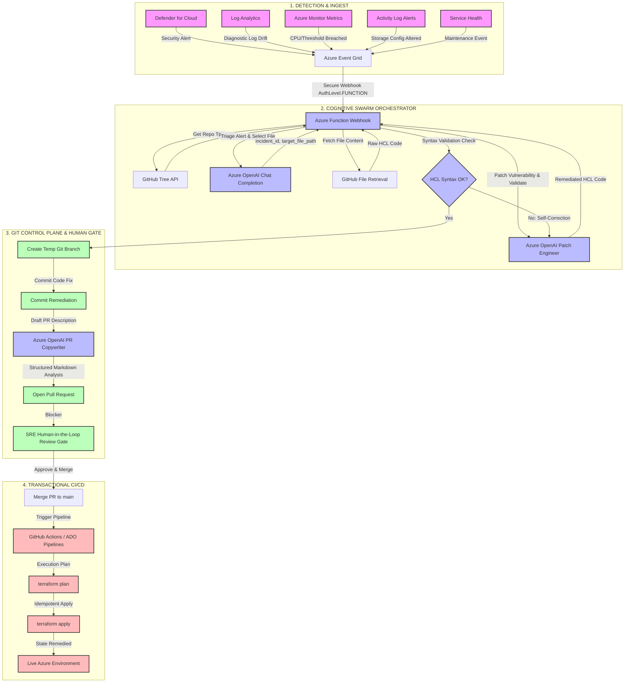

# AzureOps SecOps Swarm Triage: Deployment & Testing Guide

This document provides complete instructions for deploying the Python-based SecOps Swarm Triage Azure Function App and executing manual and automated test suites.

---

## 📐 End-to-End GitOps Architecture Blueprint

The following diagram illustrates the lifecycle of a cloud security event, from ingestion of polymorphic alerts to dynamic Landing Zone targeting, ending in the Human-in-the-Loop approval gate:



---

## ⏱️ Realistic MTTR Breakdown

By employing this automated GitOps model with a **Human-in-the-Loop (HITL)** gate, organizations dramatically lower their Mean Time to Remediate (MTTR) while preserving strict compliance boundaries:

1. **Detection & Event Ingress (1 – 3 minutes)**: Telemetry systems scan the cloud environment, identify the drift, and publish the alert to Azure Event Grid.
2. **Cognitive Swarm Orchestration (15 – 25 seconds)**: The Azure Function ingests the alert, identifies the exact file inside the Landing Zone codebase, generates the patched HCL, validates the syntax, and opens a Pull Request on GitHub.
3. **SRE Peer Review & Approval (2 – 5 minutes)**: An engineer reviews the OpenAI-generated PR risk analysis, verifies the terraform diff, and clicks "Merge".
4. **CI/CD Execution & Deployment (1 – 2 minutes)**: The GitHub Actions runner executes `terraform apply`, remediating the cloud infrastructure to align with Git source.
5. **Total Remediation MTTR (~5 – 10 minutes)**: Historically, manual remediation cycles take between **24 to 72 hours**. This solution reduces that window to minutes.

---

## 🛠️ Step 1: Local Development & Verification

Before publishing to Azure, verify your function locally using the Core Tools.

### 1. Prerequisites
- **Azure Functions Core Tools v4.x** installed.
- **Python 3.10** or **3.11** installed.
- Access to the target GitHub repository (`jagat1980/azureops-terraform-sentinel`).
- Azure OpenAI service credentials.

### 2. Configure Environment Variables
Create or verify the `azureops-brain/local.settings.json` file:
```json
{
  "IsEncrypted": false,
  "Values": {
    "FUNCTIONS_WORKER_RUNTIME": "python",
    "AzureWebJobsStorage": "UseDevelopmentStorage=true",
    "GITHUB_TOKEN": "<your-github-pat-token>",
    "GITHUB_REPO": "jagat1980/azureops-terraform-sentinel",
    "AZURE_OPENAI_ENDPOINT": "https://<your-openai-endpoint>.openai.azure.com/",
    "AZURE_OPENAI_KEY": "<your-openai-key>",
    "OPENAI_DEPLOYMENT_NAME": "gpt-5.4"
  }
}
```

### 3. Run Locally
Navigate to the function app directory and start the local runtime host:
```powershell
cd c:\myailearn\projects\azureops-test-harness\azureops-brain
func start
```

---

## 🚀 Step 2: Deploy to Azure

To move from local testing to your Azure cloud tenant, follow these deployment steps:

### 1. Create the Azure Function App (CLI)
Run the following Azure CLI commands to spin up the required resources:

```bash
# 1. Create a Resource Group
az group create --name rg-azureops-secops --location eastus

# 2. Create an Azure Storage Account (required by Function Apps)
az storage account create \
  --name stazureopsfunc \
  --location eastus \
  --resource-group rg-azureops-secops \
  --sku Standard_LRS

# 3. Create the Function App on Linux running Python 3.11 with secure system settings
az functionapp create \
  --name func-secops-swarm-triage \
  --storage-account stazureopsfunc \
  --resource-group rg-azureops-secops \
  --consumption-plan-location eastus \
  --functions-version 4 \
  --os-type Linux \
  --runtime python \
  --runtime-version 3.11
```

### 2. Configure Azure App Settings
Apply your environment variables directly to the Azure Function App configuration. This is the cloud equivalent to `local.settings.json`:

```bash
az functionapp config appsettings set --name func-secops-swarm-triage --resource-group rg-azureops-secops --settings \
  GITHUB_TOKEN="<your-github-pat-token>" \
  GITHUB_REPO="jagat1980/azureops-terraform-sentinel" \
  AZURE_OPENAI_ENDPOINT="https://<your-openai-endpoint>.openai.azure.com/" \
  AZURE_OPENAI_KEY="<your-openai-key>" \
  OPENAI_DEPLOYMENT_NAME="gpt-5.4"
```

### 3. Publish Code to Azure
Log into Azure via `az login`, navigate to the `azureops-brain/` directory, and run the publisher tool:

```powershell
cd c:\myailearn\projects\azureops-test-harness\azureops-brain
func azure functionapp publish func-secops-swarm-triage
```

---

## ⚡ Step 3: Event Grid webhook Integration

If triggering the remediation workflow from Azure Event Grid:

1. Go to **Azure Event Grid Partner Topics** / **System Topics**.
2. Create an **Event Subscription**.
3. Choose the **Webhook** Endpoint Type.
4. Set the Endpoint URL to:
   ```
   https://func-secops-swarm-triage.azurewebsites.net/api/swarm-triage?code=<FUNCTION_KEY>
   ```
   *Note: Under AuthLevel.FUNCTION, the `code` query parameter contains the authorization host key generated by Azure Functions.*
5. Click **Create**. Event Grid will trigger a handshake check. The function contains native logic on lines 47–51 of [function_app.py](file:///c:/myailearn/projects/azureops-test-harness/azureops-brain/function_app.py#L47-L51) to validate and respond to this verification request.

---

## 🧪 Step 4: Core Validation Test Cases

Ensure the HTTP endpoint responds to Event Grid handshake verification requests.

* **Target URL**: `http://localhost:7071/api/swarm-triage` (Local)
* **HTTP Method**: `POST`
* **Request Payload**:
```json
[
  {
    "id": "2d17db39-8067-45f5-b66a-38292261277f",
    "topic": "/subscriptions/test-sub/resourceGroups/rg-test",
    "subject": "",
    "data": {
      "validationCode": "512d38b6-c7b8-40c8-87da-a419f403aa23",
      "validationUrl": "https://rp-eastus.eventgrid.azure.net:553/eventsubscriptions/sub/validate?id=512d38b6"
    },
    "eventType": "Microsoft.EventGrid.SubscriptionValidationEvent",
    "eventTime": "2026-06-10T15:00:00.0000000Z",
    "metadataVersion": "1",
    "dataVersion": "2"
  }
]
```

* **Expected Response Status**: `200 OK`
* **Expected Response Body**:
```json
{
  "validationResponse": "512d38b6-c7b8-40c8-87da-a419f403aa23"
}
```

---

## 🔮 Step 5: Landing Zone Polymorphic Alert Testing

We have built a test runner script [test_all_payloads.py](file:///c:/myailearn/projects/azureops-test-harness/test_all_payloads.py) that you can run locally to verify how the Cognitive Triage handles multiple distinct Azure alert formats across storage, compute, database, and network resources.

### Executing the Multi-Payload Test Runner
Activate your virtual environment and run the test suite:
```powershell
python c:\myailearn\projects\azureops-test-harness\test_all_payloads.py
```

This script will run eight tests:
1. **Azure Monitor Activity Log Alert (Storage)**
2. **Azure Monitor Metric Alert (Storage)**
3. **Service Health Alert (Storage)**
4. **Log Analytics/Diagnostic Logging Alert (Storage)**
5. **CPU Threshold Alert (Compute/VM)** - Targets `modules/compute/main.tf`
6. **Microsoft Defender for Cloud Security Alert (Storage)**
7. **Network Security Group Public Port Rule Alert (Network)** - Targets `modules/network/main.tf`
8. **SQL Server Firewall Open Alert (Database)** - Targets `modules/database/main.tf`
