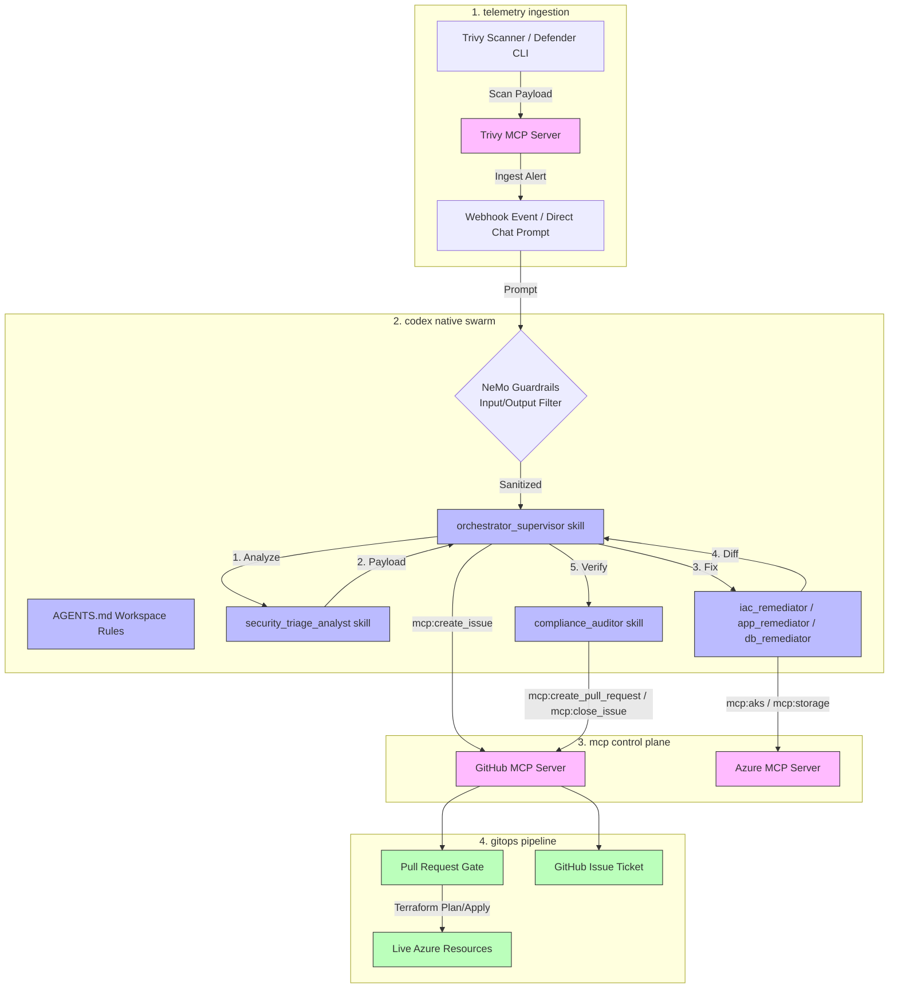
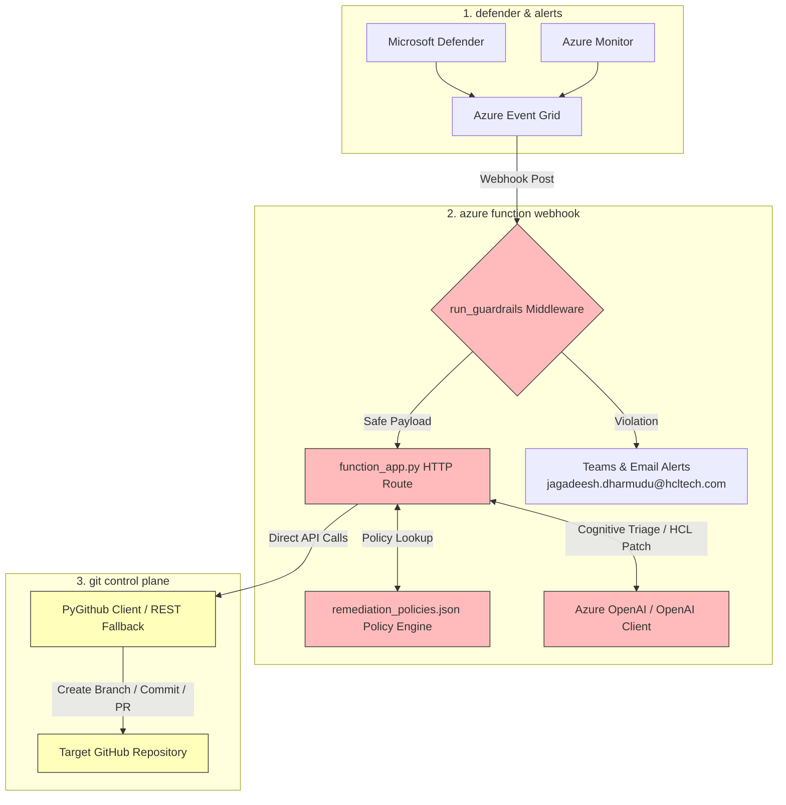
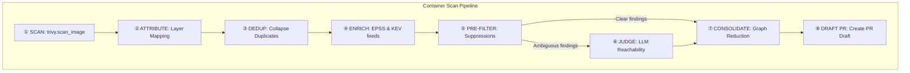

# CloudSecAIOps: Enterprise GitOps Blueprint
### Dual-Architecture Reference Specification: Codex Native Swarm & Azure Function Webhook

This document provides the architectural specification for the two distinct remediation solutions available in the **CloudSecAIOps** repository:
1. **Solution 1: Codex App Native Multi-Agent Swarm (IDE-Driven)**
2. **Solution 2: Azure Function Webhook Remediation Engine (API-Driven)**

---

## SOLUTION 1: Codex App Native Multi-Agent Swarm

This solution runs natively inside the Codex App environment, utilizing prompt-based agent cooperation (skills) and Model Context Protocol (MCP) servers for cloud and Git integration.

### 1. Functional Architecture Diagram

### 2. Operational Specification

| Component | Interface / Skill | Mechanics | Guardrails & Persona |
| :--- | :--- | :--- | :--- |
| **Swarm Orchestrator** | `orchestrator_supervisor` | Coordinates subagents via `invoke_subagent` and `send_message`. Creates GitHub Issues to track alert lifecycle. | Signed off as `[Agent: orchestrator_supervisor]`. Adheres to NIST CSF 2.0 GV.RM-02. |
| **Risk Profiler** | `security_triage_analyst` | Extracts asset target details, maps to CIS/NIST compliance controls. | Signed off as `[Agent: security_triage_analyst]`. Banned from dynamic persona naming. |
| **Fix Engineers** | `iac_remediator`, `app_remediator`, `db_remediator` | Generates secure Terraform patches (IaC/Database) or upgrades container packages. | Isolated workspaces. Only modifies target files. Runs Checkov verification. |
| **Peer Reviewer** | `compliance_auditor` | Evaluates Git diffs, runs Checkov validation, creates PR, and closes GitHub Issue. | Signed off as `[Agent: compliance_auditor]`. Forbidden from merging PRs. |
| **Input/Output Guardrail** | `NeMo Guardrails / AGENTS.md` | Intercepts prompts/outputs before they reach agents or execute actions. | Enforces workspace security rules, topic limits, and blocks command/role hijackings. |

---

## SOLUTION 2: Azure Function Webhook Remediation Engine

This solution runs as a serverless Python backend, using deterministic rule mappings, LLM cognitive fallback, and direct SDK/REST API client libraries.

### 1. Functional Architecture Diagram

### 2. Operational Specification

| Component | Code Module / Interface | Mechanics | Guardrails & Persona |
| :--- | :--- | :--- | :--- |
| **Ingestion Middleware** | `run_guardrails` | Intercepts webhook payloads to verify safety before processing. | Scans for prompt injections, topic drifts, and exposed secrets. Blocks on failure (403). |
| **Triage & Patching** | `function_app.py` | Parsers extract alert facts. Passes HCL code to OpenAI for surgical patching. | Integrates syntax verification (validate_hcl_syntax). Falls back to local workspace on Git 401. |
| **Policy Engine** | `remediation_policies.json` | Config-driven rules mapping resource providers to modules. | Restricts patching to specific compliance-defined properties (e.g. storage public access). |
| **Git Automation** | `PyGithub / GitHub API` | Programmatically creates Git branches, commits HCL patches, and opens PRs. | PR title format standard: `🚨 SecOps Auto-Fix [Severity][AlertID]`. |
| **Alert Notification** | `send_security_alert` | Integrates with Microsoft Teams Webhook and direct email routing. | Routes guardrail triggers immediately to `jagadeesh.dharmudu@hcltech.com`. |

---

## CONTAINER IMAGE SCAN ANALYSIS AGENT (Solution 1)

This agent parses container image scan telemetry (such as from Trivy or Grype), applies deterministic layer mapping and enrichment feeds, and uses cognitive LLM reasoning only for ambiguous reachability calls before drafting a Pull Request.

### 1. The 8-Step Pipeline

### 2. Pipeline Execution Steps

| Step | Operation | Technical Mechanics | LLM vs. Deterministic |
| :--- | :--- | :--- | :--- |
| **① SCAN** | `trivy.scan_image` | Ingests raw scan report / SBOM from the Trivy MCP server. | Deterministic (auth: none, in-cluster) |
| **② ATTRIBUTE** | Layer Mapping | Maps each CVE to specific OCI layers (`base` OS / `app` code / `dep` library). | Deterministic (parses OCI history/manifest) |
| **③ DEDUP** | Collapse Duplicates | Collapses duplicate findings using a unique key: `cve + pkg + version + layer_sha`. | Deterministic |
| **④ ENRICH** | Threat Enrichment | Fetches EPSS exploit probability scores and CISA KEV (Known Exploited Vulnerabilities) flags. | Deterministic (parallel threat feed lookups) |
| **⑤ PRE-FILTER** | Rules Engine | Auto-suppresses build-only dependencies (e.g., `gcc`, `make`) and applies `won't-fix` rules. Bypassed for PCI-DSS payment images. | Deterministic Rules |
| **⑥ JUDGE** | Reachability & Upgrade | Resolves ambiguous reachability paths and conducts upgrade safety / breaking-change analysis. | **Cognitive LLM** (Sonnet / GPT-4o / GPT-5.5) |
| **⑦ CONSOLIDATE** | Graph Reduction | Groups findings by fix path (e.g., '1 base image bump = N CVEs fixed'). | Deterministic Graph Reduction |
| **⑧ DRAFT PR** | `create_pull_request` | Programmatically commits patched files and opens a draft PR. | Deterministic (requires human approval: true) |

### 3. Implementation Reference

The container image scan analysis pipeline is fully implemented inside the workspace helper script:
* **Remediation Script**: [trivy_analyzer.py](file:///c:/myailearn/projects/azureops-test-harness/scripts/trivy_analyzer.py)
* **Remediation Plan**: Resolves container package CVEs (such as OpenSSL) and exposes the `Task` abstraction class to manage step outcomes, durations, and outputs dynamically.

