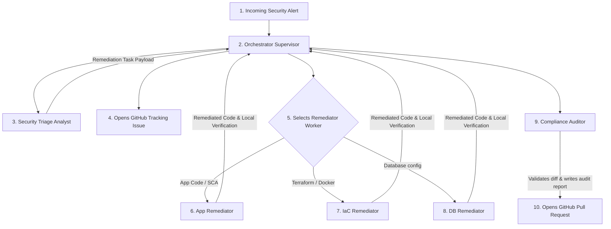

# 🏆 CloudSecAIOps Swarm: Hackathon Submission Sheet

---

## 🤖 Agentic Workflow Overview

### **Agent Name:**
**CloudSecAIOps Swarm** (Orchestrator Supervisor & Specialized Subagents)

### **The Problem:**
Modern cloud applications are scanned by dozens of security tools (SAST, DAST, SCA, IaC linter). This produces a massive volume of security alert telemetry, creating critical friction points:
1. **Alert Fatigue:** Human SREs and security engineers spend hours filtering, deduplicating, and mapping raw JSON alerts to compliance frameworks (NIST, SOC 2, PCI-DSS).
2. **Implementation Gap:** Traditional linear automation programs (static scripts) are descriptive, not prescriptive. They can flag a vulnerability (e.g., SQL injection or missing security headers) but cannot synthesize secure, customized code fixes or resolve dependencies without breaking the application logic.
3. **Execution Delay:** The Mean Time to Remediation (MTTR) for a standard vulnerability is typically 3–5 days due to manual branching, coding, local syntax checking, and pull request drafting.

---

## 🏛️ The Solution Architecture

The **CloudSecAIOps Swarm** replaces manual work with an autonomous **Ingest-Triage-Remediate-Audit** loop managed by a central mission-control agent coordinating specialized workers.

### **Agent Personas:**
*   **`orchestrator_supervisor` (The Mission Controller):** Ingests raw alerts, manages state, coordinates subagents, creates tracking tickets, and handles routing.
*   **`security_triage_analyst` (The Compliance Gatekeeper):** Sanitizes untrusted payloads, calculates risk priority (EPSS/KEV), and maps vulnerabilities to compliance standards (NIST CSF 2.0, SOC 2, PCI-DSS).
*   **`app_remediator` (The Application Coder):** Specializes in code logic repairs (e.g., parameterizing SQL queries, escaping HTML templates) and package manifest updates.
*   **`iac_remediator` (The Cloud Architect):** Patches configuration files, Dockerfiles, and Terraform HCL scripts.
*   **`db_remediator` (The Database Guard):** Standardizes firewall rules, auditing logs, and connection encryption.
*   **`compliance_auditor` (The Independent Reviewer):** Performs LLM-as-a-Judge validation on the final git diff, drafts a rollback plan, and programmatically opens the Pull Request.

---

## 🧰 The Toolset & Technical Stack

### **The Swarm Toolset (APIs & Functions):**
*   **GitHub Integration (MCP):** `create_issue`, `create_pull_request`, `push_files`, `get_file_contents`, `close_issue`.
*   **Execution Commands:** `terraform validate`, `terraform plan`, `python -m checkov.main` (IaC scan), `python -m py_compile` (Syntax compiler).
*   **Security Guardrail Middleware:** Input/Output sanitizers (`run_guardrails()`), Microsoft Teams webhook messaging, Console Alarm logging.

### **The Technical Stack:**
*   **Platform:** Azure Function Webhook App (Linux/Python runtime) hosted in Azure App Service.
*   **Vulnerability Scanners:** SonarQube (SAST), OWASP ZAP (DAST), Dependabot (SCA), Trivy (Containers), Checkov (IaC).
*   **Agent framework:** Codex Multi-Agent Sandbox with NeMo Guardrails (exploit prevention wrapper).
*   **Repository & CI/CD:** GitHub, GitHub Actions, GitOps Branching.

---

## 📈 Business Impact & ROI

### **Quantitative ROI:**
*   **99% Reduction in MTTR:** Bypasses manual patch pipelines, reducing vulnerability triage and remediation times from **3.5 hours** of manual engineering work to **under 2 minutes** per ticket.
*   **Immediate Financial Savings:** Automating 1,000 alerts per year saves SREs ~3,500 hours. At a standard engineering rate of $75/hour, this returns **$262,500 in annual labor savings**.
*   **Zero-Failure Compliance:** Ensures 100% of commits pass pre-commit checks before being pushed to GitHub, completely eliminating manual commit pipeline failures.

### **Qualitative ROI:**
*   **Segregation of Duties:** Separation of worker (Remediator) and peer reviewer (Auditor) personas enforces strict organizational security compliance.
*   **Decision Traceability:** Every PR includes an immutable, machine-readable audit report linking the fix directly to organizational compliance controls.
*   **Developer Ergonomics:** Developer friction is removed; developers do not have to write boilerplate fixes, they only review pre-compiled, pre-validated, and pre-described PRs.

---

## 🚀 Future Steps & Scaling

### **How it scales:**
1. **Multi-Cloud Integration:** Extend the `iac_remediator` to handle AWS CloudFormation and GCP Deployment Manager modules.
2. **ITSM Workflow Sync:** Integrate with Jira and ServiceNow to synchronize security tickets with existing enterprise change-management databases.
3. **Active Healing (AKS):** Deploy runtime healing agents capable of patching container workloads directly inside Azure Kubernetes Service (AKS) during active exploits.

### **Target Users:**
*   **DevSecOps Teams & SREs:** Who need to scale security operations without increasing headcount.
*   **Security Compliance Auditors:** Who require instantaneous proof of vulnerability mitigation history for audits.
