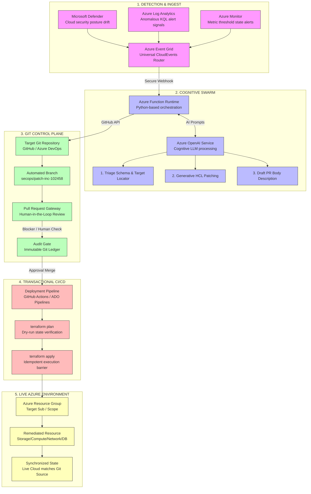

# AzureOps Sentinel: Enterprise GitOps Blueprint
### A Multi-Source Event-Driven Declarative Remediation Architecture for Terraform-Managed Public Cloud Infrastructures

This document provides an editable representation of the architectural blueprint and lifecycle specification for the **AzureOps Sentinel** auto-remediation engine.

---

## 1. End-to-End Event-Driven Functional Architecture Diagram

The diagram below represents the functional telemetry and remediation pipeline. It is written in **Mermaid** format, which can be natively edited or rendered in markdown previewers, Azure DevOps, and GitHub:

---

## 2. Deep Dive Lifecycle Mappings & System Specifications

| Lifecycle Phase | Component & Technical Interface | Core Operational Mechanics | OpenAI Cognitive Footprint |
| :--- | :--- | :--- | :--- |
| **DIAGNOSING & INGESTION** | Azure Event Grid System Topic  `monitoringService: "Defender"` | Ingests polymorphic JSON structures from divergent telemetry planes. Standardizes communication via the CloudEvents v1.0 standard, shielding downstream modules from Microsoft event schema modifications. | **Footprint #1: Cognitive Parser & Locator** Extracts nested variables (e.g. compromised asset) into a unified internal JSON definition and identifies target landing zone files dynamically. |
| **REMEDIATING & ORCHESTRATION** | Azure Function (Python) & GitHub API | The function checks out the repository context, passes the affected `.tf` block to OpenAI, handles branch creation, commits the altered declarative state, and programmatically spawns a Pull Request. | **Footprint #2: Generative HCL Patching** Analyzes existing configurations against policy violations and modifies specific attributes safely (e.g. turning public access off, restricting security group ports). |
| **VERIFYING & CI/CD** | CI/CD Engine & Terraform Core  `terraform plan -out=tfplan` | Triggered dynamically upon PR creation. Runs transactional dry-runs against the active `.tfstate` storage backend to verify structural integrity, syntactic validity, and identify blast radius before changes touch target subscriptions. | *None.* (Decoupled completely from LLM code generation to enforce strict deterministic safeguards and state file alignment). |
| **REPORTING & AUDIT** | Pull Request Interface & Git Ledger | Consolidates automated analytical breakdowns directly within the standard engineering workflow. The merged branch generates an immutable, cryptographically signed ledger record inside the version control database. | **Footprint #3: PR Copywriting** Generates comprehensive Markdown documentation detailing Business Impact Summaries, blast radiuses, and compliance review metadata for SRE sign-off. |
