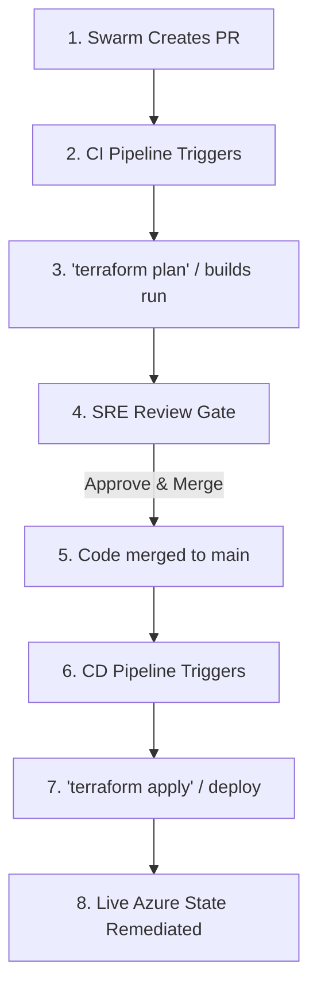

# 🚀 Reviewer Guide: End-to-End GitOps Auto-Remediation Demo

This guide provides step-by-step instructions for Hackathon reviewers to run live demonstrations of the **CloudSecAIOps Swarm Triage** solution using the Codex App.

---

## 📋 Prerequisites & Initial Setup

Before running the demos, ensure the local workspace is reset to a "vulnerable" state so the Swarm has findings to patch:

1. **Open PowerShell** in the project root: `c:\myailearn\projects\azureops-test-harness`
2. **Reset the local files** to their vulnerable state by running:
   ```powershell
   # Revert webapp dependencies in requirements.txt
   Set-Content app/requirements.txt "flask==2.2.2`nrequests==2.28.0`ncryptography==39.0.0`ngunicorn==21.2.0"

   # Revert the Dockerfile to vulnerable base image
   Set-Content Dockerfile "FROM alpine:3.17.0`nRUN apk add --no-cache openssl=3.0.7-r0"
   ```
3. **Clean up remote GitHub state** (to prevent the deduplication engine from skipping PR creation):
   * Open the GitHub repository: [azureops-terraform-sentinel](https://github.com/jagat1980/azureops-terraform-sentinel)
   * If there are open Pull Requests (like PR #126), close them.
   * If there are open Issues (like Issue #125), close them.

---

## ⚡ Demo Scenario 1: Python Dependency Remediation (SCA)

This scenario demonstrates the Swarm detecting outdated Python libraries with critical vulnerabilities, upgrading them, and opening a Pull Request.

### Steps:
1. **Launch the Codex App** and open the chat window.
2. **Locate the SCA alert payload** at: [payloads/sca_dependabot_pip.json](file:///c:/myailearn/projects/azureops-test-harness/payloads/sca_dependabot_pip.json)
3. **Copy the entire JSON payload** from that file.
4. **Paste the payload** into the Codex App chat with the following instruction:
   ```text
   $orchestrator_supervisor - triage web app alert which has EPSS scoring above 0.90
   [Paste JSON Here]
   ```
5. **Watch the Swarm Execute Live (End-to-End Coordination):**
   * 📥 **Alert Ingress:** The `orchestrator_supervisor` intercepts the incoming JSON alert and quarantine-wraps it in `<INCOMING_ALERT>` tags.
   * 🧠 **Phase 1: Cognitive Triage:** The supervisor invokes **`security_triage_analyst`** to parse the raw Dependabot payload. The analyst identifies the affected library (`cryptography`, `flask`), assesses severity, maps findings to compliance frameworks (NIST CSF 2.0, SOC 2, PCI-DSS), and returns a sanitized Remediation Task Payload to the supervisor.
   * 🎫 **Phase 2: Incident Creation:** The supervisor reads the triage result and calls the GitHub API to open a tracking issue (incident ticket) on the repository. The supervisor stores the returned `<Issue_ID>`.
   * 🛠️ **Phase 3: Remediation:** The supervisor delegates the patch to **`app_remediator`**, passing the target file (`app/requirements.txt`) and `<Issue_ID>`. The remediator:
     * Checks out a local branch `remediate/webapp-dependencies`.
     * Upgrades the package pins to secure versions (`cryptography==41.0.4`, `flask==2.3.2`, `requests==2.31.0`).
     * Performs local validation, runs a python compiler check, commits the changes, and reports `REMEDIATED` status back to the supervisor.
   * ⚖️ **Phase 4: Independent Peer Review (LLM-as-a-Judge):** The supervisor invokes **`compliance_auditor`** for validation. The auditor:
     * Reviews the git diff against the compliance checklist.
     * Drafts a professional PR description documenting the Decision Audit Trail, rollback plan, and compliance mapping.
     * Programmatically opens a Pull Request on GitHub containing the string `Fixes #<Issue_ID>`.

### Verification:
* Go to the GitHub repository:
  * Check **Issues**: Verify that a new ticket titled `🚨 Security Alert: Outdated Python Dependencies (SCA)` has been created.
  * Check **Pull Requests**: Verify that a new PR titled `🚨 SecOps Auto-Fix [CRITICAL]...` has been opened, linking directly to the issue (`Fixes #<Issue_ID>`) with a rollback plan and security impact table.

---

## ⚡ Demo Scenario 2: Container Image Security Triage (Dockerfile)

This scenario demonstrates how the Swarm triages base OS package vulnerabilities (like OpenSSL), updates the Dockerfile, and pushes the fix.

### Steps:
1. **Locate the Trivy container payload** at: [payloads/trivy_container_openssl_cve.json](file:///c:/myailearn/projects/azureops-test-harness/payloads/trivy_container_openssl_cve.json)
2. **Copy the entire JSON payload** from that file.
3. **Paste the payload** into the Codex App chat with the following instruction:
   ```text
   $orchestrator_supervisor - triage container alert
   [Paste JSON Here]
   ```
4. **Watch the Swarm Execute Live (End-to-End Coordination):**
   * 📥 **Alert Ingress:** The `orchestrator_supervisor` ingests the Trivy OS package alert payload.
   * 🧠 **Phase 1: Cognitive Triage:** The supervisor invokes **`security_triage_analyst`** to isolate the container finding. The analyst maps `CVE-2023-75689` to the `Dockerfile` base image layer, matches it to security controls, and alerts the supervisor.
   * 🎫 **Phase 2: Incident Creation:** The supervisor opens a new GitHub Issue to track the OpenSSL vulnerability.
   * 🛠️ **Phase 3: Remediation:** The supervisor delegates to **`iac_remediator`**. The remediator:
     * Checks out a branch `remediate/openssl-cve-2023-75689`.
     * Patches the `Dockerfile` to pin `openssl=3.0.8-r0`.
     * Runs the pre-commit hook validation (`python -m checkov.main -d terraform/`), which executes successfully with `0` failed checks.
     * Commits the changes and returns success.
   * ⚖️ **Phase 4: Independent Peer Review (LLM-as-a-Judge):** The supervisor invokes **`compliance_auditor`**, which reviews the HCL/Docker diffs, generates the GitOps compliance report, and programmatically opens the Pull Request on GitHub.

### Verification:
* Check **Pull Requests** on GitHub to verify the Dockerfile patch is proposed and linked to a tracking issue.

---

## 🔍 How to Open the Repository & What Happens Next

### 1. How the Reviewer Accesses the GitHub Repo
The reviewer can view all issues, code changes, and pull requests directly in their browser:
*   **Target URL:** [https://github.com/jagat1980/azureops-terraform-sentinel](https://github.com/jagat1980/azureops-terraform-sentinel)
*   **Local Terminal Command:** To inspect the remote URLs from the command line:
    ```bash
    git remote -v
    ```

### 2. What Happens Next (The GitOps Lifecycle Post-PR)
Once the Swarm creates the Pull Request, it triggers the enterprise Change Management and Deployment workflow:



1. **Continuous Integration (CI) Validation:**
   The open Pull Request automatically triggers the repository's GitHub Actions CI pipeline. This pipeline executes formatting checks, syntax validation (`terraform validate`), and plans (`terraform plan`), automatically attaching build metrics and checkov output back to the PR comments.
2. **SRE Human-in-the-Loop Review:**
   An engineer reviews the PR. The GenAI-drafted PR description provides everything they need: a summary of changes, threat vectors, a rollback plan, and compliance control mappings.
3. **Merging to Main:**
   If the code passes review and pipeline checks, the reviewer merges the PR into the `main` branch. 
   *(Note: Swarm agents are strictly prohibited from merging their own PRs to preserve segregation of duties).*
4. **Continuous Deployment (CD) & Live Remediation:**
   Merging to `main` triggers the CD pipeline, executing `terraform apply` or building the new container. The live Azure resources are automatically configured to align with Git, sealing the loop and self-healing the cloud environment.
