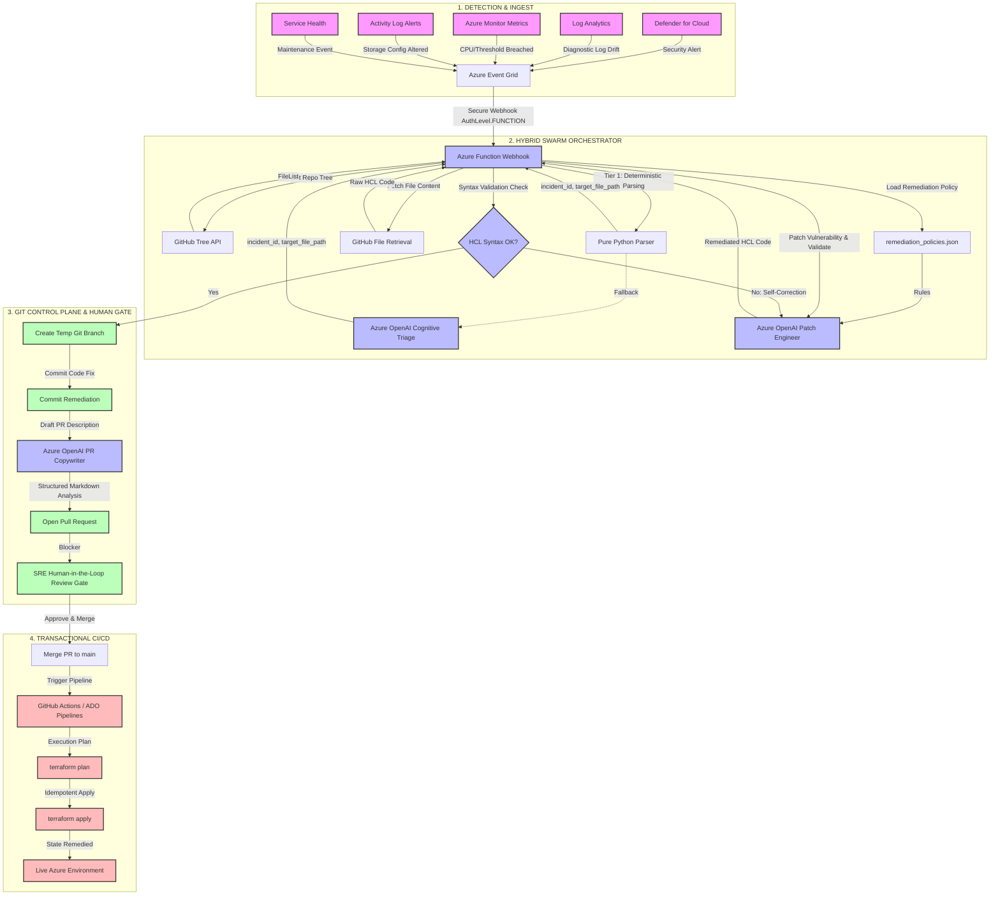

# AzureOps SecOps Swarm Triage: Autonomous GitOps Remediation Solution

This document details the architecture, configuration, implementation, and verification steps of the **AzureOps SecOps Swarm Triage** auto-remediation solution. This engine automates the lifecycle of public cloud security event triage, Generative HCL patching, syntax validation, and SRE Pull Request generation.

---

## 📐 End-to-End GitOps Architecture Blueprint

The following workflow diagram illustrates the lifecycle of a cloud security event, from telemetry ingestion to dynamic Landing Zone targeting, ending in the Human-in-the-Loop approval gate:



---

## ⏱️ Realistic MTTR Breakdown

By employing this automated GitOps model with a **Human-in-the-Loop (HITL)** gate, organizations dramatically lower their Mean Time to Remediate (MTTR) while preserving strict compliance boundaries:

1. **Detection & Event Ingress (1 – 3 minutes)**: Telemetry systems scan the cloud environment, identify the drift, and publish the alert to Azure Event Grid.
2. **Hybrid Swarm Orchestration (10 – 15 seconds)**: The Azure Function ingests the alert using a tiered approach. Known alert schemas are parsed deterministically (0ms, 0 tokens), while unrecognized schemas fall back to LLM cognitive routing. The function then fetches the file, injects config-driven remediation rules, generates the patch, validates the HCL syntax, and opens a PR.
3. **SRE Peer Review & Approval (2 – 5 minutes)**: An engineer reviews the OpenAI-generated PR risk analysis, verifies the terraform diff, and clicks "Merge".
4. **CI/CD Execution & Deployment (1 – 2 minutes)**: The GitHub Actions runner executes `terraform apply`, remediating the cloud infrastructure to align with Git source.
5. **Total Remediation MTTR (~5 – 10 minutes)**: Historically, manual remediation cycles take between **24 to 72 hours**. This solution reduces that window to minutes.

---

## 🛠️ System Components & Implementation Detail

### 1. Deterministic Alert Parser
The [parse_alert_deterministic](file:///c:/myailearn/projects/azureops-test-harness/azureops-brain/function_app.py#L27-L57) function in [function_app.py](file:///c:/myailearn/projects/azureops-test-harness/azureops-brain/function_app.py) attempts to extract incident metadata from a well-known Azure Monitor Common Alert Schema payload using pure Python.
If the schema is unrecognized, it falls back to the LLM cognitive triage (`COGNITIVE` mode), ensuring robust support for polymorphic payloads.

### 2. Config-Driven File Resolver & Policy Engine
At cold start, the Azure Function loads policies defined in [remediation_policies.json](file:///c:/myailearn/projects/azureops-test-harness/azureops-brain/remediation_policies.json).
The file resolver maps the detected resource type to corresponding Terraform files:
* **Microsoft.Storage** maps to `modules/storage/` (e.g. [main.tf](file:///c:/myailearn/projects/azureops-test-harness/modules/storage/main.tf))
* **Microsoft.Compute** maps to `modules/compute/` (e.g. [main.tf](file:///c:/myailearn/projects/azureops-test-harness/modules/compute/main.tf))
* **Microsoft.Network** maps to `modules/network/` (e.g. [main.tf](file:///c:/myailearn/projects/azureops-test-harness/modules/network/main.tf))
* **Microsoft.Sql** maps to `modules/database/`

### 3. HCL Syntax Validation & Self-Correction
The HCL validator ([validate_hcl_syntax](file:///c:/myailearn/projects/azureops-test-harness/azureops-brain/function_app.py#L85-L112)) runs a local bracket-balancing and markdown-ticks validation check.
If the LLM returns an invalid syntax structure, the function utilizes a self-correcting retry loop (up to 2 attempts), passing the validation error back to Azure OpenAI to regenerate a syntactically correct patch.

---

## 💰 Operational Cost & TCO Analysis

Deploying the system under a serverless, pay-as-you-go architecture ensures that costs are close to zero during inactive periods.

### 1. One-Time Setup Costs
* **All Components**: **$0.00** (Uses native platform APIs and existing subscriptions).

### 2. Recurring Monthly Operational Costs (Assuming 1,000 alert events / month)
| Service Component | Pricing Tier | Monthly Consumption | Monthly Cost |
| :--- | :--- | :--- | :--- |
| **Azure Event Grid** | Basic (First 100k events free; then $0.60/M) | ~1,000 alert routings | **$0.00** |
| **Azure Functions (Serverless)** | Premium/Consumption (1M free executions, then $0.20/M; 400k GB-sec free) | ~1,000 executions (avg. 30s at 1.5GB) | **~$0.80** |
| **Azure Storage (Metadata & Logs)** | Hot LRS ($0.02 / GB + transaction costs) | ~2 GB active storage & operational logs | **~$0.50** |
| **Azure OpenAI Service** | GPT-4o Pay-as-you-go ($5.00/1M input, $15.00/1M output tokens) | ~1,000 hybrid events (patch & PR only) | **~$22.00** |
| **GitHub Actions / CI/CD** | Team / Enterprise (includes free minutes) | ~50 PR plan & apply builds | **$0.00** (Included) |
| **Total Recurring Cost** | **Estimated Enterprise Cloud Overhead** | **~1,000 auto-remediations / month** | **~$23.30 / month** |

> [!TIP]
> **Average Cost per Remediation**: ~$0.023. Manual engineering labor typically costs **$150 to $300** per incident ticket. This represents a **99.98% cost reduction** per event.

---

## 🧪 Testing & Verification Guide

### 1. Running Locally
Configure environment variables in `azureops-brain/local.settings.json`:
```json
{
  "IsEncrypted": false,
  "Values": {
    "FUNCTIONS_WORKER_RUNTIME": "python",
    "AzureWebJobsStorage": "UseDevelopmentStorage=true",
    "GITHUB_TOKEN": "<your-github-pat-token>",
    "GITHUB_REPO": "jagat1980/azureops-terraform-sentinel",
    "AZURE_OPENAI_ENDPOINT": "https://<your-openai-endpoint>.openai.azure.com/",
    "AZURE_OPENAI_KEY": "<your-openai-key>",
    "OPENAI_DEPLOYMENT_NAME": "gpt-5.4"
  }
}
```

Navigate to `azureops-brain/` and run the function app host:
```powershell
cd c:\myailearn\projects\azureops-test-harness\azureops-brain
func start
```

### 2. Multi-Payload Test Suite
The repository includes a comprehensive python test script: [test_all_payloads.py](file:///c:/myailearn/projects/azureops-test-harness/test_all_payloads.py).
Run the suite locally to verify alert triage across storage, compute, network, and database resources:
```powershell
python c:\myailearn\projects\azureops-test-harness\test_all_payloads.py
```
